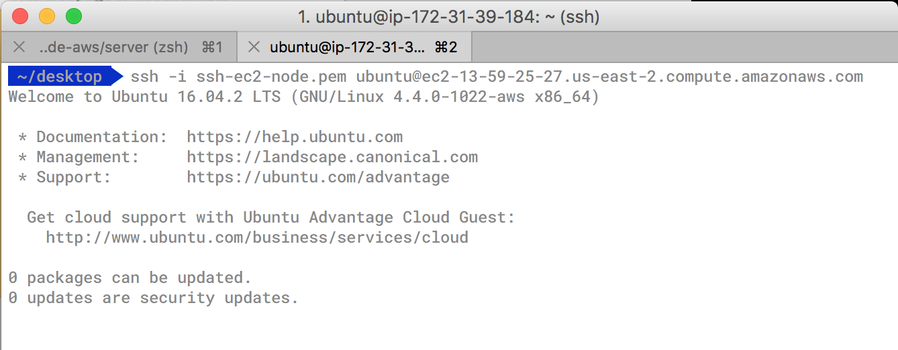
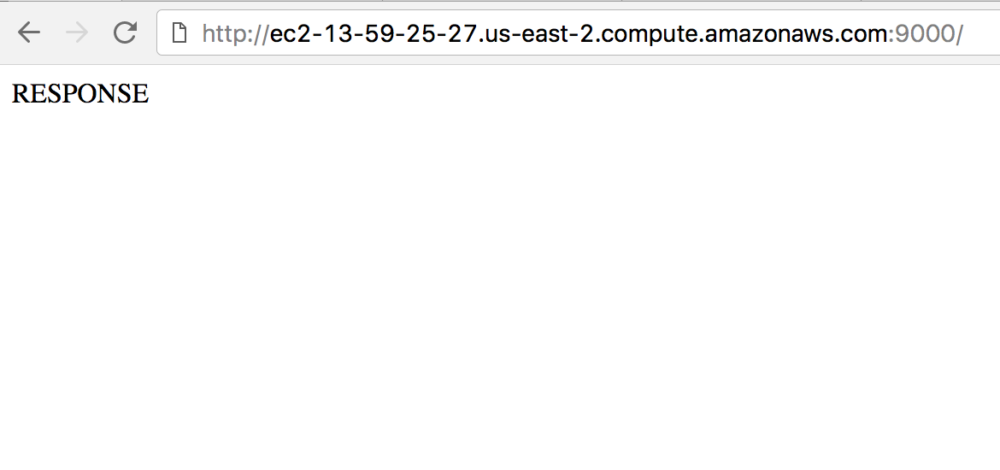

# node-aws

Exploring migrating live services into AWS from a private data centre

Potential technologies that will be used for this project:

* Node.js
* Express.js
* Pug
* MongoDB & Mongoose for database
* Mocha & Zombie for testing
* Travis CI for Integration
* AWS

## Session One

To start exploring, I set myself the task of creating and managing a Node.js server on AWS. Getting to grips with AWS seemed okay and I was able to start an EC2 server and SSH into the server relatively easily! I created the server using Express after initializing Node. Attaining a public DNS response, I was interested as to how to put the process under version control or implement testing.

*SSH Connected:*

*Public DNS Response:*

